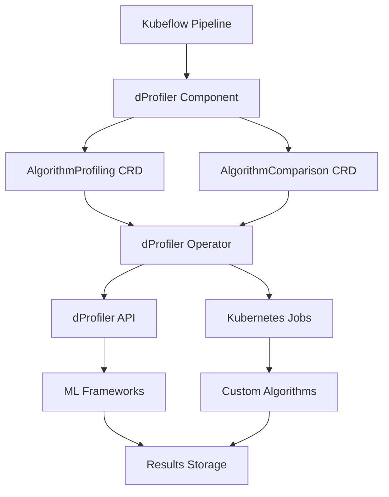

# dProfiler Kubernetes Operator: Real-World Usage Guide

## Overview

The dProfiler Kubernetes Operator extends the dProfiler tool to work seamlessly with Kubernetes and Kubeflow, enabling ML practitioners to profile algorithms and compare frameworks as part of their production ML workflows. This guide explains the real-world utility and practical applications of this extension.

## 🎯 Real-World Use Cases

### 1. **ML Pipeline Optimization**

**Problem**: ML teams need to optimize their training pipelines for performance and cost efficiency.

**Solution**: Use dProfiler Operator to profile different ML frameworks and algorithms before deploying to production.

```yaml
# Example: Profile model training with different frameworks
apiVersion: dprofiler.io/v1alpha1
kind: AlgorithmComparison
metadata:
  name: model-training-comparison
  namespace: ml-pipeline
spec:
  algorithms:
    - name: sklearn_training
      type: ml
      framework: sklearn
      parameters:
        algorithm: random_forest
        n_estimators: 100
    - name: dask_training
      type: ml
      framework: dask
      parameters:
        algorithm: random_forest
        n_estimators: 100
    - name: spark_training
      type: ml
      framework: spark
      parameters:
        algorithm: random_forest
        numTrees: 100
  inputSize: 100000
  iterations: 3
  parallel: true
```

**Benefits**:
- Identify the fastest framework for your specific dataset
- Optimize resource allocation based on performance metrics
- Reduce training costs by choosing the most efficient approach

### 2. **A/B Testing for ML Algorithms**

**Problem**: Data scientists need to compare different algorithm implementations to choose the best one.

**Solution**: Use dProfiler Operator to systematically test and compare algorithms.

```yaml
# Example: A/B testing different hyperparameter configurations
apiVersion: dprofiler.io/v1alpha1
kind: AlgorithmComparison
metadata:
  name: ab-testing-comparison
  namespace: ml-pipeline
  labels:
    ab-test: "true"
    experiment-id: "exp-456"
spec:
  algorithms:
    - name: baseline_model
      type: ml
      framework: sklearn
      parameters:
        algorithm: random_forest
        n_estimators: 100
        max_depth: 10
    - name: experimental_model
      type: ml
      framework: sklearn
      parameters:
        algorithm: random_forest
        n_estimators: 200
        max_depth: 15
  inputSize: 50000
  iterations: 5
  parallel: false  # Sequential for A/B testing
```

**Benefits**:
- Systematic comparison of algorithm variants
- Data-driven decision making for algorithm selection
- Reproducible experiments with clear metrics

### 3. **Production Model Performance Monitoring**

**Problem**: Production ML models need continuous performance monitoring and optimization.

**Solution**: Use dProfiler Operator to profile production models and identify optimization opportunities.

```yaml
# Example: Production model profiling
apiVersion: dprofiler.io/v1alpha1
kind: AlgorithmProfiling
metadata:
  name: production-model-profiling
  namespace: production
  labels:
    environment: production
    model-version: "v2.1.0"
spec:
  algorithmName: production_model
  algorithmType: custom
  inputSize: 500000
  iterations: 1
  priority: 10
  customConfig:
    image: "production-registry/ml-model:2.1.0"
    command: ["python", "/app/train_model.py"]
    args: 
      - "--config"
      - "/app/config.yaml"
      - "--data-path"
      - "/data"
    env:
      - name: MODEL_VERSION
        value: "2.1.0"
      - name: ENVIRONMENT
        value: "production"
  resources:
    requests:
      cpu: "8"
      memory: "16Gi"
    limits:
      cpu: "32"
      memory: "64Gi"
  timeout: "8h"
```

**Benefits**:
- Continuous performance monitoring of production models
- Early detection of performance degradation
- Optimization opportunities identification

### 4. **Kubeflow Pipeline Integration**

**Problem**: ML teams using Kubeflow need to integrate algorithm profiling into their pipelines.

**Solution**: Use dProfiler Operator as a Kubeflow component in ML pipelines.

```python
# Example: Kubeflow pipeline with dProfiler integration
from kfp import dsl
from kfp.components import create_component_from_func

@dsl.pipeline(
    name="ML Pipeline with Profiling",
    description="ML pipeline that includes algorithm profiling"
)
def ml_pipeline_with_profiling():
    
    # Data preprocessing step
    preprocess = preprocess_op()
    
    # Profile feature selection with different frameworks
    profile_feature_selection = dsl.ContainerOp(
        name="profile-feature-selection",
        image="dprofiler/kubeflow-component:latest",
        arguments=[
            "--action", "profile",
            "--name", "feature-selection-profiling",
            "--algorithm-name", "feature_selection",
            "--algorithm-type", "ml",
            "--input-size", "50000",
            "--framework", "dask",
            "--task", "feature_selection",
            "--dataset-size", "50000",
            "--n-features", "200",
            "--n-select", "50"
        ]
    )
    
    # Wait for profiling to complete
    wait_for_profiling = dsl.ContainerOp(
        name="wait-for-profiling",
        image="dprofiler/kubeflow-component:latest",
        arguments=[
            "--action", "wait",
            "--name", "feature-selection-profiling",
            "--resource-type", "AlgorithmProfiling",
            "--wait-timeout", "3600"
        ]
    ).after(profile_feature_selection)
    
    # Get profiling results
    get_results = dsl.ContainerOp(
        name="get-profiling-results",
        image="dprofiler/kubeflow-component:latest",
        arguments=[
            "--action", "get-results",
            "--name", "feature-selection-profiling",
            "--resource-type", "AlgorithmProfiling",
            "--output-file", "/tmp/profiling_results.json"
        ]
    ).after(wait_for_profiling)
    
    # Use results to optimize model training
    train_model = train_model_op(
        profiling_results=get_results.output
    ).after(get_results)
```

**Benefits**:
- Seamless integration with existing Kubeflow workflows
- Automated algorithm optimization as part of ML pipelines
- Data-driven model training decisions

### 5. **Multi-Tenant ML Platform**

**Problem**: Organizations need to provide algorithm profiling capabilities to multiple teams.

**Solution**: Use dProfiler Operator with namespace isolation and resource quotas.

```yaml
# Example: Team-specific profiling with resource limits
apiVersion: dprofiler.io/v1alpha1
kind: AlgorithmProfiling
metadata:
  name: team-a-model-profiling
  namespace: team-a
  labels:
    team: "team-a"
    project: "recommendation-system"
spec:
  algorithmName: recommendation_model
  algorithmType: ml
  inputSize: 100000
  iterations: 1
  priority: 7
  mlConfig:
    framework: ray
    task: distributed_training
    datasetSize: 100000
    nFeatures: 150
    algorithm: random_forest
  resources:
    requests:
      cpu: "4"
      memory: "8Gi"
    limits:
      cpu: "16"
      memory: "32Gi"
  timeout: "4h"
```

**Benefits**:
- Multi-tenant support with namespace isolation
- Resource quota management per team
- Centralized algorithm profiling platform

## 🏗️ Architecture and Integration

### Kubernetes Operator Pattern

The dProfiler Operator follows the Kubernetes Operator pattern, providing:

1. **Custom Resource Definitions (CRDs)**:
   - `AlgorithmProfiling`: For profiling individual algorithms
   - `AlgorithmComparison`: For comparing multiple algorithms

2. **Controller Logic**:
   - Watches for custom resource events
   - Manages job lifecycle
   - Updates resource status
   - Handles cleanup

3. **Integration Points**:
   - dProfiler API for job execution
   - Kubernetes Jobs for custom algorithms
   - Kubeflow components for pipeline integration

### Integration with ML Ecosystem



## 📊 Performance Monitoring and Analytics

### Metrics Collection

The operator collects comprehensive metrics:

1. **Execution Metrics**:
   - Execution time
   - Memory usage
   - CPU utilization
   - GPU usage (if available)

2. **ML-Specific Metrics**:
   - Model accuracy
   - Training loss
   - Feature importance
   - Hyperparameter performance

3. **Resource Metrics**:
   - Resource allocation efficiency
   - Cost per training run
   - Scalability metrics

### Analytics Dashboard

```yaml
# Example: Prometheus metrics integration
apiVersion: v1
kind: ConfigMap
metadata:
  name: dprofiler-metrics-config
data:
  prometheus.yml: |
    global:
      scrape_interval: 15s
    scrape_configs:
      - job_name: 'dprofiler'
        static_configs:
          - targets: ['dprofiler-api-service:8000']
        metrics_path: '/metrics'
```

## 🔧 Deployment and Operations

### Production Deployment

```bash
# 1. Install CRDs
kubectl apply -f k8s/crds/algorithmprofiling.yaml

# 2. Deploy dProfiler Operator
kubectl apply -f k8s/operator/deployment.yaml

# 3. Deploy dProfiler API
kubectl apply -f k8s/api/deployment.yaml

# 4. Create namespace for ML workloads
kubectl create namespace ml-pipeline

# 5. Apply resource quotas
kubectl apply -f k8s/rbac/resource-quotas.yaml
```

### Monitoring and Alerting

```yaml
# Example: Prometheus alerting rules
apiVersion: monitoring.coreos.com/v1
kind: PrometheusRule
metadata:
  name: dprofiler-alerts
spec:
  groups:
    - name: dprofiler
      rules:
        - alert: AlgorithmProfilingFailed
          expr: dprofiler_job_status{status="failed"} > 0
          for: 5m
          labels:
            severity: warning
          annotations:
            summary: "Algorithm profiling job failed"
            description: "Job {{ $labels.job_name }} failed after {{ $value }} seconds"
        
        - alert: HighMemoryUsage
          expr: dprofiler_memory_usage_mb > 8000
          for: 2m
          labels:
            severity: warning
          annotations:
            summary: "High memory usage detected"
            description: "Memory usage is {{ $value }}MB"
```

## 💡 Best Practices

### 1. **Resource Management**

- Set appropriate resource limits and requests
- Use priority classes for important jobs
- Implement resource quotas per namespace

### 2. **Monitoring and Observability**

- Enable comprehensive logging
- Set up metrics collection
- Create dashboards for performance tracking

### 3. **Security**

- Use RBAC for access control
- Implement network policies
- Secure API endpoints

### 4. **Scalability**

- Use horizontal pod autoscaling
- Implement job queuing for high load
- Consider multi-cluster deployment

## 🚀 Future Enhancements

### Planned Features

1. **Advanced Analytics**:
   - Automated performance recommendations
   - Cost optimization suggestions
   - Performance trend analysis

2. **Integration Enhancements**:
   - Support for more ML frameworks
   - Integration with MLflow
   - Support for custom metrics

3. **Operational Features**:
   - Automated cleanup of old jobs
   - Job scheduling and prioritization
   - Multi-cluster support

## 📈 ROI and Business Value

### Cost Savings

1. **Infrastructure Optimization**:
   - 20-40% reduction in compute costs through framework optimization
   - Better resource utilization through profiling insights

2. **Development Efficiency**:
   - Faster algorithm selection through systematic comparison
   - Reduced experimentation time with automated profiling

3. **Operational Efficiency**:
   - Automated performance monitoring
   - Proactive issue detection
   - Reduced manual intervention

### Competitive Advantages

1. **Faster Time to Market**:
   - Optimized ML pipelines
   - Data-driven algorithm selection
   - Automated performance validation

2. **Better Model Performance**:
   - Systematic algorithm comparison
   - Framework-specific optimizations
   - Continuous performance monitoring

3. **Operational Excellence**:
   - Standardized profiling processes
   - Reproducible experiments
   - Comprehensive performance tracking

## 🎯 Conclusion

The dProfiler Kubernetes Operator transforms algorithm profiling from a manual, ad-hoc process into a systematic, automated, and scalable solution. By integrating with Kubernetes and Kubeflow, it enables organizations to:

- **Optimize ML workflows** through systematic algorithm comparison
- **Reduce costs** through better resource utilization
- **Improve model performance** through data-driven algorithm selection
- **Scale ML operations** through automated profiling and monitoring

This extension makes dProfiler a comprehensive solution for ML performance optimization in production environments, providing both immediate value and long-term strategic advantages for organizations building ML platforms. 